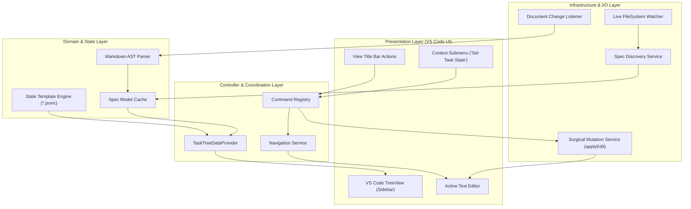
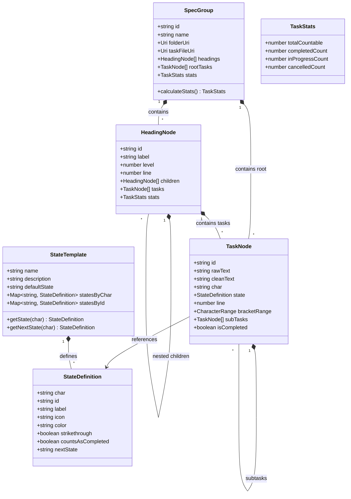
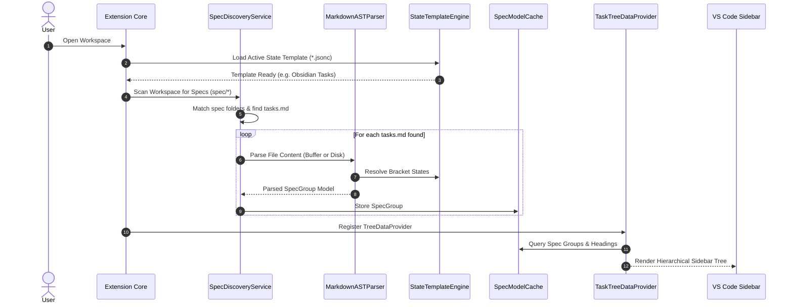
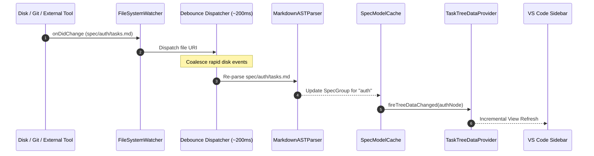
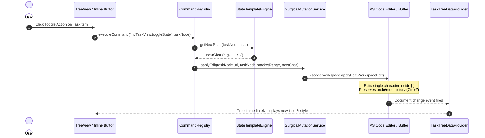
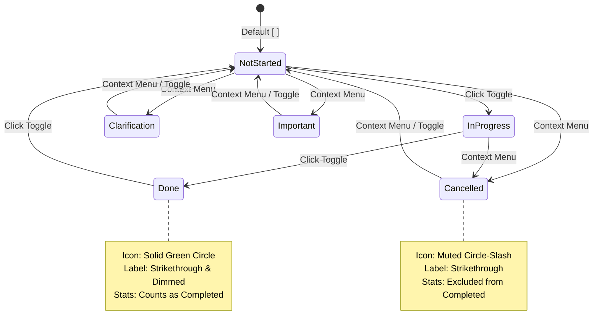

# Architecture & System Design (`design.md`)

This document defines the software architecture, component relationships, data models, state machines, and sequence lifecycles for the **VS Code Markdown Task View** (`vscode-md-taskview`) extension.

---

## 1. Architectural Overview & System Decomposition

The extension follows a clean, decoupled **Layered Event-Driven Architecture**. The layers ensure separation between VS Code presentation, domain parsing logic, disk synchronization, and file mutation.



---

## 2. Component Descriptions

### 2.1 Presentation Layer
- **`TaskTreeDataProvider`:** Implements `vscode.TreeDataProvider<TaskTreeNode>`. Translates domain models (`SpecGroup`, `HeadingNode`, `TaskNode`) into VS Code `TreeItem` instances with appropriate icons, labels, strikethrough formatting, and collapsible states.
- **Commands & Context Menus:** Exposes actions for toggling task state, jumping to source lines, collapsing all nodes, filtering completed tasks, and opening custom template configurations.

### 2.2 Controller & Coordination Layer
- **`CommandRegistry`:** Binds VS Code command IDs (`mdTaskView.toggleState`, `mdTaskView.jumpToSource`, `mdTaskView.refresh`, etc.) to internal services.
- **`NavigationService`:** Handles opening documents in `vscode.window.showTextDocument` and positioning the cursor and viewport selection on target lines.

### 2.3 Domain & State Layer
- **`SpecModelCache`:** In-memory store holding the parsed hierarchical representations of all discovered specs. Enables instant tree rendering without synchronous disk I/O.
- **`MarkdownASTParser`:** Parses markdown text into a hierarchical tree: `# Heading` nodes containing sub-headings and checklist items. Tracks exact zero-indexed line and character ranges.
- **`StateTemplateEngine`:** Loads, parses, and validates `*.jsonc` state definitions (Standard GFM, Obsidian Tasks, or custom user files). Resolves state icons, colors, strikethrough flags, and transition cycles.

### 2.4 Infrastructure & I/O Layer
- **`SpecDiscoveryService`:** Evaluates glob patterns (`./spec/*`) to find matching folders and task files (`tasks.md`).
- **`FileSystemWatcherService`:** Manages `vscode.workspace.createFileSystemWatcher` instances to capture external disk modifications, deletions, and file creations.
- **`DocumentChangeListener`:** Listens to `vscode.workspace.onDidChangeTextDocument` for active in-memory buffers to provide real-time updates as the user types.
- **`SurgicalMutationService`:** Executes atomic, non-destructive character replacements on the markdown file using `vscode.workspace.applyEdit`.

---

## 3. Data Models & Domain Schema



---

## 4. Sequence Lifecycles

### 4.1 Extension Activation & Initial Tree Loading



---

### 4.2 Live Filesystem Synchronization (External & Editor Buffer)



---

### 4.3 In-Place State Toggling & Non-Destructive Mutation



---

## 5. State Machine: Multi-State Obsidian Tasks Mode

The State Template Engine supports non-binary transitions. When configured with the **Obsidian Tasks** template, tasks transition through the following lifecycle via click-to-cycle or direct context menu selection:



---

## 6. Detailed Component Designs

### 6.1 Surgical Mutation Engine
To ensure **zero formatting corruption** and 100% reliable git diffs:
1. When parsing `tasks.md`, the parser records the exact zero-based position:
   ```typescript
   export interface BracketRange {
     line: number;        // Zero-indexed line number
     openBracketCol: number;  // Column of '['
     charCol: number;         // Column of character between '[' and ']'
     closeBracketCol: number; // Column of ']'
   }
   ```
2. When a state change occurs, the replacement range targets only `charCol`:
   ```typescript
   const edit = new vscode.WorkspaceEdit();
   const replaceRange = new vscode.Range(
     new vscode.Position(task.bracketRange.line, task.bracketRange.charCol),
     new vscode.Position(task.bracketRange.line, task.bracketRange.charCol + 1)
   );
   edit.replace(task.fileUri, replaceRange, nextChar);
   await vscode.workspace.applyEdit(edit);
   ```
3. Because this utilizes VS Code's `WorkspaceEdit`, it works seamlessly across dirty buffers and clean on-disk files, pushing directly to the standard undo/redo history (`Ctrl+Z`).

### 6.2 Visual Styling Implementation (Green Circle & Strikethrough)
- **Green Circle Check Indicator:**
  VS Code allows `ThemeIcon` colors using `ThemeColor`:
  ```typescript
  treeItem.iconPath = new vscode.ThemeIcon(
    'pass-filled', // Native green check circle in VS Code
    new vscode.ThemeColor('charts.green')
  );
  ```
- **Crossed-Out Text (Strikethrough):**
  VS Code `TreeItem` labels can be formatted using `TreeItemLabel` or Unicode strikethrough characters:
  ```typescript
  // Approach: Markdown-aware or Unicode strikethrough transformation
  function applyStrikethrough(text: string): string {
    return text.split('').map(char => char + '\u0336').join('');
  }
  ```
  Additionally, the item's `description` can show completion tags, and the `tooltip` displays the full unformatted task text and line context.

### 6.3 State Template Engine (`*.jsonc`)
1. **Parser:** Utilizes `jsonc-parser` (`parseTree` / `parse`) to parse JSON with comments and trailing commas safely.
2. **Pre-Packaged Templates:**
   - Bundled in extension resources (`resources/templates/standard.jsonc`, `resources/templates/obsidian.jsonc`).
3. **Custom Template Loader:**
   - Evaluates `mdTaskView.customTemplatePath`. Resolves relative paths against workspace root.
   - Validates template structure with helpful diagnostic logging. If invalid, safely falls back to standard GFM.

### 6.4 Filesystem Watching & Debouncing Strategy
- A single `vscode.FileSystemWatcher` pattern is configured:
  ```typescript
  const pattern = new vscode.RelativePattern(workspaceRoot, `${specPathPattern}/${taskFileName}`);
  const watcher = vscode.workspace.createFileSystemWatcher(pattern);
  ```
- File events (`create`, `change`, `delete`) are routed through a debounced dispatcher with a **200ms trailing timer**:
  - Multiple rapid disk modifications (e.g. `git checkout`) collapse into a single tree refresh.
  - Active editor buffer changes (`onDidChangeTextDocument`) use a **150ms trailing timer** and only re-parse the memory string buffer without reading disk.

---

## 7. Error Handling & Edge Cases

| Scenario | Handling Strategy |
| :--- | :--- |
| **No spec folders found** | Show native VS Code welcome view (`viewsWelcome`) with buttons to initialize sample spec or open settings. |
| **Empty or taskless `tasks.md`** | Render spec group node with dimmed description `(no tasks)` and collapsible state `None`. |
| **Malformed Markdown line** | Skip malformed line; parser preserves line count and continues reading subsequent valid headings/tasks. |
| **Unmapped bracket character (e.g., `[>]`)** | Render with neutral fallback icon (`circle-small-filled`); preserve character unmodified on any other edits. |
| **File locked or read-only on disk** | `applyEdit` failure caught in `try/catch`; display `vscode.window.showErrorMessage` without corrupting tree cache. |
| **Multi-root workspaces with duplicate spec names** | Prefix group labels with the workspace folder name (e.g., `repo-a / auth` vs `repo-b / auth`). |
