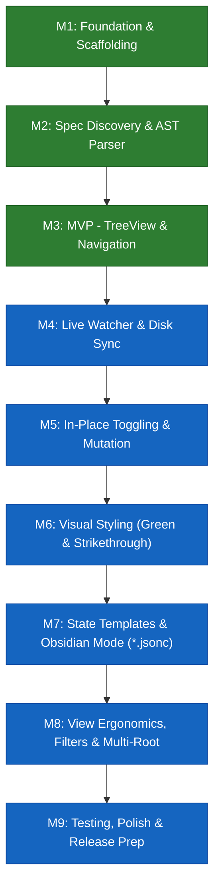

# Development Milestones: VS Code Markdown Task View

This document outlines the high-level development roadmap for `vscode-md-taskview`, structured into 9 focused milestones starting with an end-to-end Minimum Viable Product (MVP).

---

## Roadmap Overview

---

## Milestone 1: Project Foundation & Extension Scaffolding (MVP Part 1)
**Goal:** Establish a robust TypeScript extension codebase with basic VS Code container and configuration wiring.

- Initialize VS Code extension project structure (TypeScript, esbuild/tsc, ESLint, VS Code test runner).
- Register dedicated Activity Bar view container and primary sidebar TreeView (`mdTaskView.tasksView`).
- Define basic VS Code settings schema (`mdTaskView.specPathPattern`, `mdTaskView.taskFileName`).
- Implement basic logging and extension lifecycle activation/deactivation hooks.

---

## Milestone 2: Spec Discovery & Markdown AST Parser (MVP Part 2)
**Goal:** Scan workspace for spec folders and parse target markdown files into a clean hierarchical in-memory data model.

- Implement workspace discovery service to find directories matching `./spec/*` and identify `tasks.md`.
- Build a lightweight Markdown Abstract Syntax Tree (AST) parser to extract:
  - Heading levels (`#` through `######`) with document line numbers.
  - Standard markdown checklist items (`- [ ]`, `- [x]`) and associate them with their parent heading.
- Construct the internal document tree model: `Spec Folder` $\rightarrow$ `Nested Headings` $\rightarrow$ `Checklist Tasks`.

---

## Milestone 3: Hierarchical TreeView & Jump-to-Source Navigation (MVP Complete)
**Goal:** Deliver a working Minimum Viable Product where users can visually browse tasks and navigate to source lines.

- Implement VS Code `TreeDataProvider` to render the parsed document hierarchy:
  - Top-level spec groups (named after spec directories).
  - Expandable/collapsible heading branches.
  - Leaf checklist items with binary states (pending / done).
- Add click-to-navigate command: clicking any task or heading opens the file in the editor and scrolls/highlights the exact line.
- Display basic completion statistics `(completed/total)` on spec groups and headings.
- **Deliverable:** Working MVP extension capable of scanning specs and jumping to tasks in the editor.

---

## Milestone 4: Continuous Filesystem Watching & Live Disk Sync
**Goal:** Ensure the sidebar tree view is always 100% in sync with changes on disk without manual refresh.

- Implement continuous filesystem watching using `vscode.workspace.createFileSystemWatcher` targeting spec paths.
- Synchronize with file creation, deletion, renaming, and external disk edits (e.g., git branch switches, external tools).
- Hook into active editor text changes (`onDidChangeTextDocument`) with debouncing (~150ms) to ensure smooth real-time typing response.
- Invalidate and incrementally re-parse only affected spec files to preserve performance.

---

## Milestone 5: In-Place Task State Toggling & Non-Destructive Mutation
**Goal:** Allow users to toggle task completion directly from the tree view with full editor undo/redo support.

- Implement inline toggle action on task tree items to flip state between `[ ]` and `[x]`.
- Perform non-destructive text replacements using `vscode.workspace.applyEdit`, mutating only the bracket character while preserving indentation, line endings, and surrounding text.
- Guarantee seamless integration with VS Code's editor undo/redo stack (`Ctrl+Z`).

---

## Milestone 6: Expressive Visual Styling (Green Circles & Strikethrough)
**Goal:** Elevate visual clarity with distinct status styling according to product specifications.

- Implement strikethrough (crossed-out) text styling for completed tasks with subtle dimmed contrast.
- Render completed checklist items with a distinct green circle check indicator (`codicon:pass-filled` with green theme styling or custom SVG).
- Render pending tasks with a neutral hollow circle outline (`codicon:circle-large-outline`).
- Add user configuration to toggle strikethrough behavior (`mdTaskView.strikeThroughCompleted`).

---

## Milestone 7: State Template System & Obsidian Tasks Mode (`*.jsonc`)
**Goal:** Provide modular, customizable task states supporting Obsidian Tasks conventions and custom `*.jsonc` mappings.

- Implement the State Template Engine capable of parsing and validating `*.jsonc` (JSON with Comments) configuration files.
- Ship pre-packaged templates:
  - **Standard (GFM):** `[ ]` Not Started, `[x]` Done.
  - **Obsidian Tasks:** `[ ]` Not Started, `[/]` In Progress, `[x]` Done, `[-]` Cancelled, `[?]` Clarification, `[!]` Important.
- Add VS Code settings dropdown to select active template (`Standard`, `Obsidian Tasks`, or `Custom`).
- Implement click-to-cycle logic based on `nextState` configuration and a right-click context menu ("Set Task State") to select any state directly.
- Ensure fallback handling for unmapped bracket characters so unconfigured states never crash or corrupt text.

---

## Milestone 8: View Controls, Filtering & Multi-Root Workspace Support
**Goal:** Round out the user experience with ergonomic tree controls, filtering, empty states, and multi-root workspace handling.

- Add view title actions:
  - **Filter Completed Tasks:** Toggle button to show/hide done items.
  - **Collapse All / Expand All:** Standard tree navigation controls.
  - **Manual Refresh:** Force re-scan of the workspace.
- Implement responsive empty states / welcome views when no spec directories are detected, offering quick-start actions.
- Full multi-root workspace support (grouping by workspace root when multiple repositories are open).

---

## Milestone 9: Automated Testing, Documentation & Packaging
**Goal:** Comprehensive test coverage, user documentation, and release readiness.

- Build comprehensive unit test suite:
  - Markdown AST parser edge cases (deep headings, top-level tasks, unformatted text).
  - State template engine and JSONC validator.
  - Text mutation safety and line preservation.
- Build integration tests for VS Code TreeDataProvider and filesystem watcher events.
- Complete documentation: `README.md`, usage guide, configuration reference, and animated demo assets.
- Package extension into production `.vsix` bundle ready for marketplace publishing.

---

## Next Step: Detailed EARS Requirements
Following milestone approval, we will define the technical requirements for each milestone using the **EARS (Easy Approach to Requirements Syntax)** framework (Ubiquitous, Event-driven, State-driven, Unwanted behavior, and Optional features).
